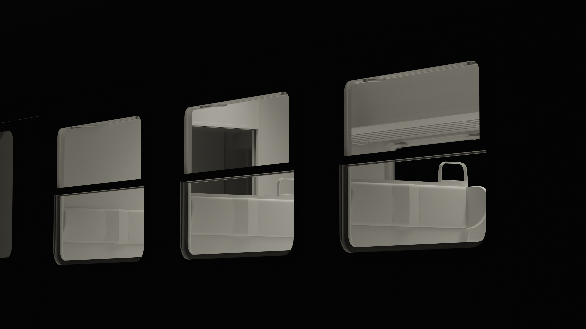
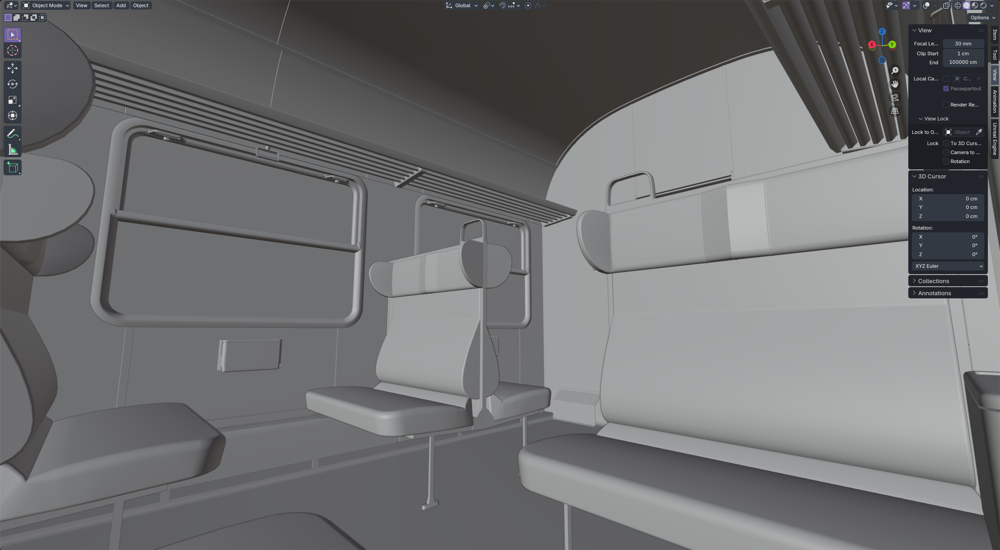
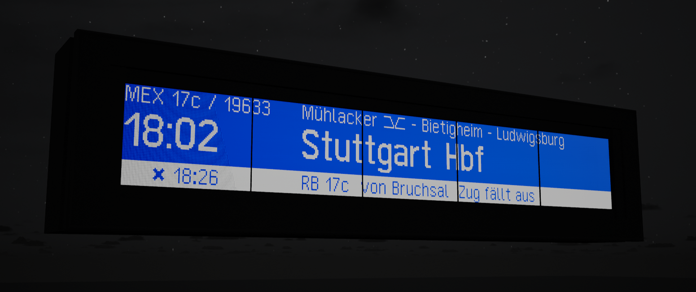
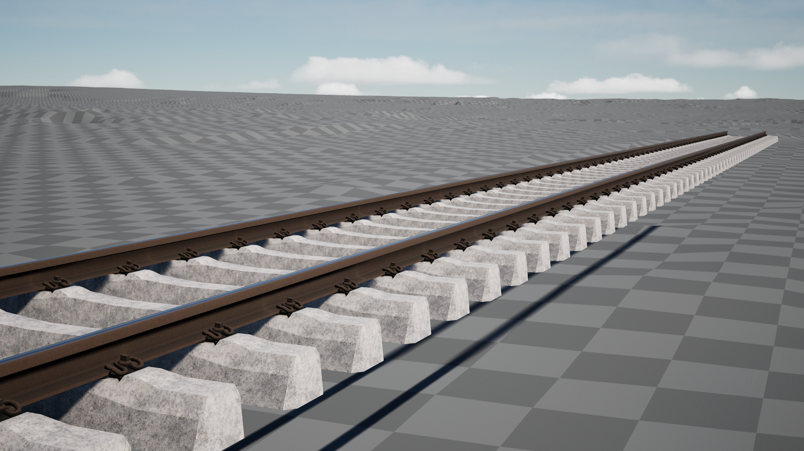
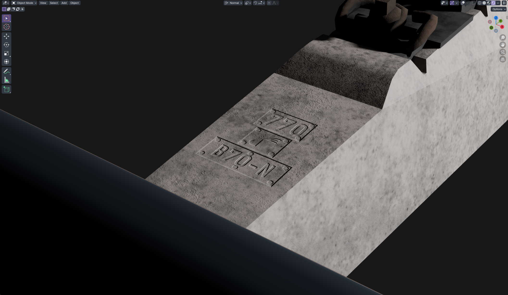
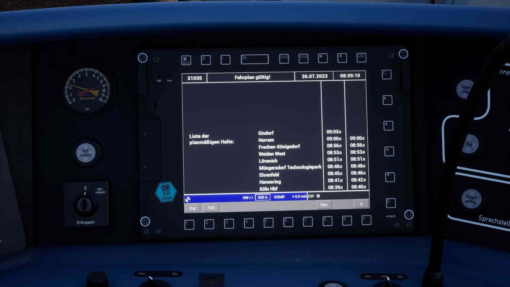

# ilo sama RAIL - Portfolio
Hiya, here's our (mostly Nagi's) portfolio of things we have infofficially done for Train Sim World. Some things are now cancelled, some are still work in progress, but we're proud to how them off nonetheless! If you got any questions, feel free to reach out!  
~ Nagi
## n-Wagen-related Projects
### Images of the first model iteration of a Bnrdzf 480.0 and a Bnrz 436.0

### Image of my new textures for the n-Wagen seats from Bremen - Oldenburg
These textures were once made for a mod for the n-Wagen from Bremen - Oldenburg, by now I have made my own models which are textureless at the moment, however.

## Rankbachbahn
So far, I have only focused on new rail network assets, mostly new station PIS screens and track assets.
### New station PIS screens

https://github.com/ilosamaRAIL/.github/portfolio/img/Rankbachbahn/2025-01-06%2001-28-47.mp4

### Track assets based on UIC norms and German standards
These were the few trial assets I made using solely Blender, also for texturing, I have since returned to using Substance Painter.

## Miscellaneous
### New PIS system decoupled from vanilla PIS systems
For my work-in-progress ICE 3 mod, I wanted more control and possibilities of the PIS, so I decided to write my own PIS system (which can also support station announcements if supplied with the necessary audio ressources). A simplified EBuLa display has been also based on this PIS system.

https://github.com/ilosamaRAIL/.github/portfolio/img/Rankbachbahn/2025-06-02%01-48-21.mp4

https://github.com/ilosamaRAIL/.github/portfolio/img/Rankbachbahn/2025-06-04%18-21-34_comp.mp4

### Other models
Before Salzburg - Rosenheim was announced, I was working on a BR 111 on my own, a model which since then hasn't been worked on further, yet I'm still sort of proud of it.

For a paused freight wagon project, I was building a bogie of type Y25Ls(s)i1f, which was pretty much done apart from some small details.
i1f_Render1.png)