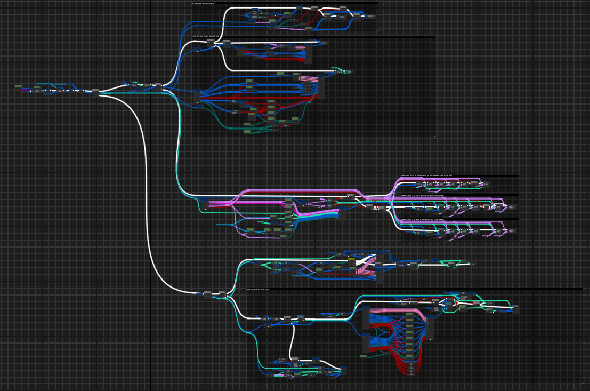
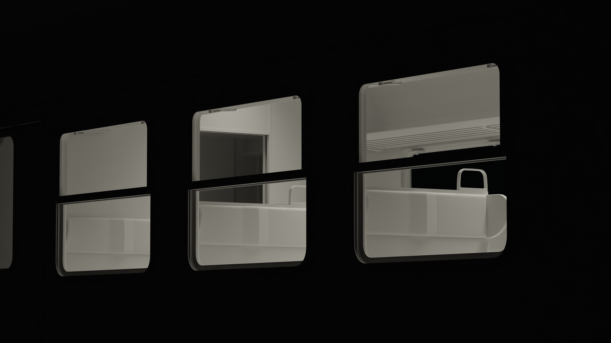
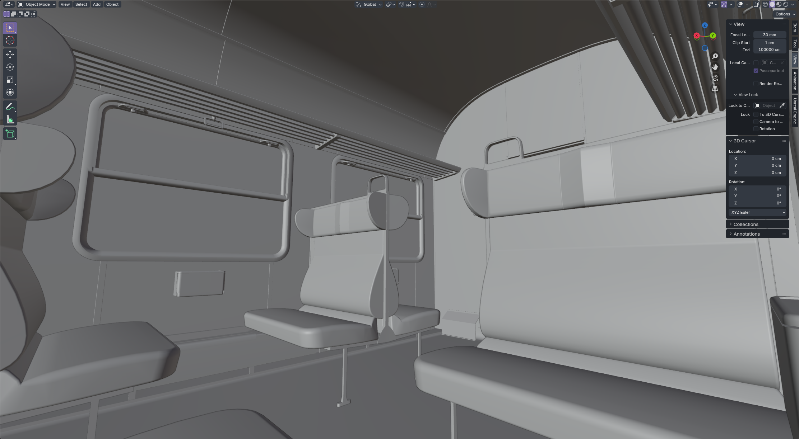
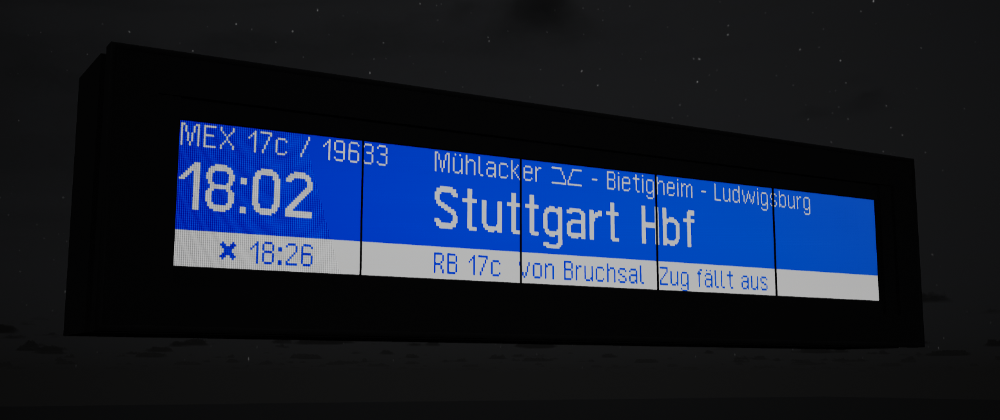
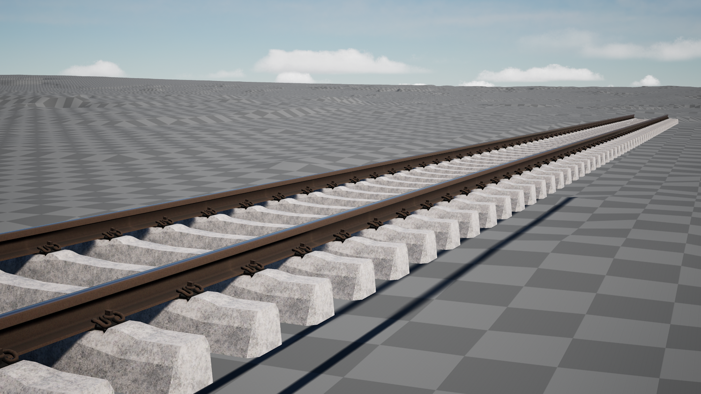
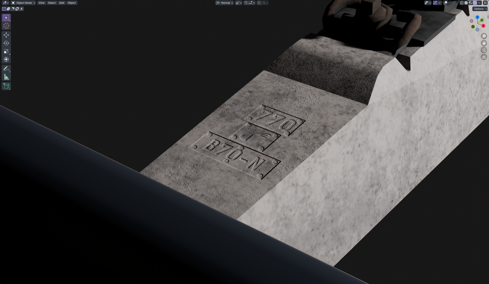
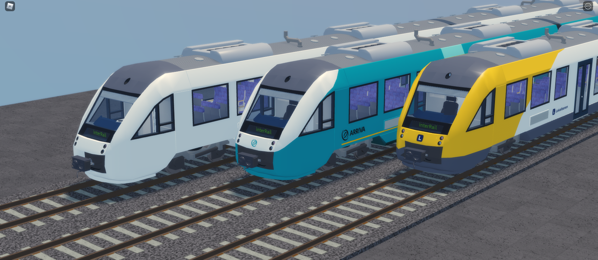

# ilo sama RAIL - Portfolio
Hiya, here's our (mostly Nagi's) portfolio of things we have for various simulators/games, but especially Train Sim World. Some things are now cancelled, some are still work in progress, but we're proud to how them off nonetheless!

All work can be assumed to be done by me (Nagi) unless otherwise specified.

If you got any questions, feel free to reach out!  
~ Nagi

## Train Sim World - Official

### DB BR 101 Expert - 101 066 "Einziganders" Decal
For TSG's/CRG's BR 101 Expert DLCs I have supplied a decal texture for the 101 066 "Einziganders" pride livery. My tasks included sourcing reference photos, stitching up those images, and touching up various spots (weathering, seams, etc). I remade the texture for this release after having already published an older (less polished) version as a free, unofficial modification.

*Screenshot of the locomotive in Train Sim World 6 with my decal applied*

## Train Sim World - Unofficial

### BR 423 Expansion Pack
For our own BR 423 Expansion Pack mod I was responsible for various systems and complex materials within Train Sim World. The highlights of the materials are the front LCD PIS done by Hannah under my instructions, and the side LCD PIS and EBuLa material done by yours truly.

*Screenshot of our EBuLa system within Train Sim World 6 showing various timetable information onboard a BR 423*

*Screenshot of our custom LCD PIS material on the side of a BR 423. Notably, each pixel consists of multiple subpixels influencing the shape of the letters*

*Screenshot of our LCD PIS material at the front of a BR 423. This was Hannah's first PIS material venture, done under my instruction and supervision.*

The programming of our custom timetable information system supplying the PIS and EBuLa with data was written entirely by me from scratch; the EBuLa blueprints were a joint venture between me and Hannah.

*Screenshot of the first iteration of our blueprint code supplying the information system with all information it needs in a tidy format easily processable by other systems.*

### n-Wagen-related Projects
Before the announcement of the *Bremen - Oldenburg* DLC for Train Sim World 3, I had been working on some n-Wagen of my own, specifically the *Bnrz 436.0* and *Bnrdzf 480.0*. Development of this project has been paused for now, though I am hoping to perhaps continue it further down the line if a purpose can be found.

After the release of *Bremen - Oldenburg*, I worked on an Enhancement Pack mod which reworked various tidbits and added multiple new features. One notable features are the seat textures which  I had remade from scratch with *Substance Painter*.

### BR 111
My model of the BR 111 has suffered the same fate as my n-Wagen as the *Salzburg - Rosenheim* DLC was announced back in early 2024. Work on this one is also halted until further notice, though I am still sort of proud of it.

### Rankbachbahn
The *Rankbachbahn* is my current route project for Train Sim World. Model-wise, I have only focused on new rail network assets for now; mostly new station PIS screens and track assets.

**New station PIS screens**  
These screens are representing the most current software version running on the german rail network and as such are more complex compared to the displays we have in TSW nowadays. The material, fonts and symbols were painstakingly done by me, though the display itself is yet to be implemented into our timetable data system.

https://github.com/user-attachments/assets/3eecbbc1-2814-4d9e-bd7d-0a0fbe1e0df6

**Track assets based on UIC norms and German standards**  
These were the few trial assets I made using solely Blender, also for texturing, I have since returned to using Substance Painter.

### Miscellaneous
#### New PIS system decoupled from vanilla PIS systems
For my heavy work-in-progress ICE 3 mod, I wanted more control and possibilities of the PIS, so I decided to write my own PIS system (which can also support station announcements if supplied with the necessary audio ressources). This eventually resulted in the system used by the BR 423 mod described below, though I'd also like to shine a light on the work I did for the ICE 3, namely the exterior displays and our own implementation of station announcements:

https://github.com/user-attachments/assets/dc7c76e6-16dd-47ae-ac0a-7f1a5abef562

https://github.com/user-attachments/assets/f3cd90de-13ba-4bb3-a5cc-64e2a173d86f

(turn on audio on this video to hear the announcements)

#### Other models
For a paused freight wagon project, I was building a bogie of type Y25Ls(s)i1f, which was pretty much done apart from some small details.
i1f_Render1.png)

## Simpler Train Assets for Roblox Games
My 3D modelling endavour originally started on Roblox of all places, eventually leading me to take my first comissions for train models for games on Roblox. Given the nature of Roblox, the assets I made back then were not as complex as the assets I'm creating today, though I like to think that it still shows what I was capable of even back then. The latest images from this series were made in 2022.

### Class 465/9
My last 3D modelling gig I did in that phase was a Class 465/9 for a never-released game featuring a fictional livery. For Roblox standards, I made as much use of the available resources as I could, resulting in the following model and texturing:

### LINT 41
Another notaible model I made back then was a LINT 41 in various liveries. After many years it eventually actually made it into a game, which you can play [here](https://www.roblox.com/games/12893488117/Train-Sim)!

## Other
This is the section where I'll just dump a few images of various smaller assets done for various insignificant purposes, be it background scenery or just messing around.

